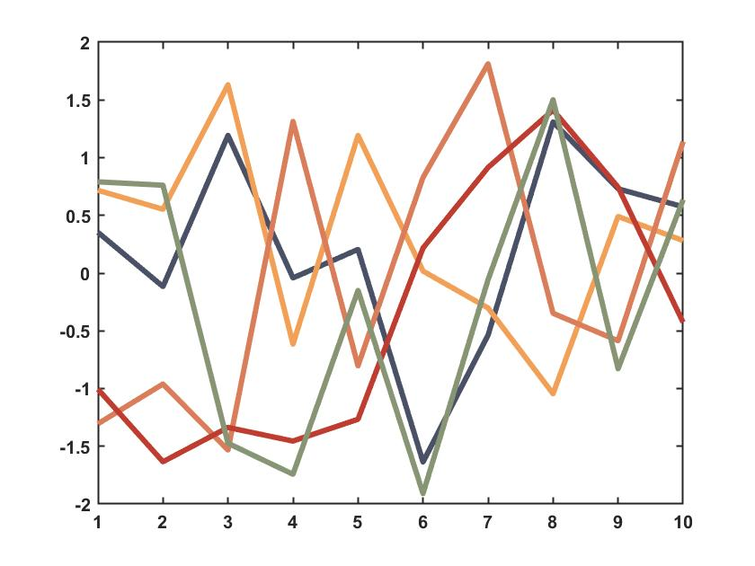
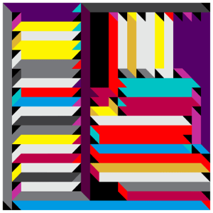

# NoahMaps
This is a collection of custom color palettes, formatted for MATLAB. What exists now is just `AlbumMaps.mat`, which is a collection of color maps based on album covers I like. The colors are as follows. Each has five colors. 

## Using the palettes
What you do with the file organization is not up to me, but I have the folder containing `AlbumMaps.mat` on my system's environment variables. Load all of them or one of them...

```
load('/path/to/file/AlbumMaps.mat')
load('/path/to/file/AlbumMaps.mat', 'map of your choice')
```

Then, you can just index the map as a cell array of triplets any time you want to use the color. For example...

```
h = plot([randn(5,10)'], 'LineWidth', 3);
h(1).Color = DGD{1};
h(2).Color = DGD{2};
h(3).Color = DGD{3};
h(4).Color = DGD{4};
h(5).Color = DGD{5};
```

This gets you something like this:



That's pretty much it. 

## Where did the palettes come from?

### Battles - *Juice B Crypts*
**Variable Name `battles`**
